<!-- # Visualizing Distributions -->
# 可视化概率分布

| ](../../sketchnotes/10-Visualizing-Distributions.png)|
|:---:|
| Visualizing Distributions - _Sketchnote by [@nitya](https://twitter.com/nitya)_ |

<!-- In the previous lesson, you learned some interesting facts about a dataset about the birds of Minnesota. You found some erroneous data by visualizing outliers and looked at the differences between bird categories by their maximum length. -->

对于有关明尼苏达州鸟类数据集，通过可视化异常值可以发现一些错误数据，并根据鸟类的最大翼展长度查看了鸟类类别之间的差异。

## [Pre-lecture quiz](https://purple-hill-04aebfb03.1.azurestaticapps.net/quiz/18)
<!-- ## Explore the birds dataset -->
## 探索鸟类数据集
<!-- Another way to dig into data is by looking at its distribution, or how the data is organized along an axis. Perhaps, for example, you'd like to learn about the general distribution, for this dataset, of the maximum wingspan or maximum body mass for the birds of Minnesota.  -->
挖掘数据的另一种方法是查看其分布，或者数据如何沿轴排列。例如，想了解此数据集中明尼苏达州鸟类最大翼展或最大体重的一般分布。

本课文件夹根目录的notebook.ipynb文件中，导入 Pandas、Matplotlib 和您的数据：
<!-- Let's discover some facts about the distributions of data in this dataset. In the _notebook.ipynb_ file at the root of this lesson folder, import Pandas, Matplotlib, and your data: -->

```python
import pandas as pd
import matplotlib.pyplot as plt
birds = pd.read_csv('../../data/birds.csv')
birds.head()
```

|      | Name                         | ScientificName         | Category              | Order        | Family   | Genus       | ConservationStatus | MinLength | MaxLength | MinBodyMass | MaxBodyMass | MinWingspan | MaxWingspan |
| ---: | :--------------------------- | :--------------------- | :-------------------- | :----------- | :------- | :---------- | :----------------- | --------: | --------: | ----------: | ----------: | ----------: | ----------: |
|    0 | Black-bellied whistling-duck | Dendrocygna autumnalis | Ducks/Geese/Waterfowl | Anseriformes | Anatidae | Dendrocygna | LC                 |        47 |        56 |         652 |        1020 |          76 |          94 |
|    1 | Fulvous whistling-duck       | Dendrocygna bicolor    | Ducks/Geese/Waterfowl | Anseriformes | Anatidae | Dendrocygna | LC                 |        45 |        53 |         712 |        1050 |          85 |          93 |
|    2 | Snow goose                   | Anser caerulescens     | Ducks/Geese/Waterfowl | Anseriformes | Anatidae | Anser       | LC                 |        64 |        79 |        2050 |        4050 |         135 |         165 |
|    3 | Ross's goose                 | Anser rossii           | Ducks/Geese/Waterfowl | Anseriformes | Anatidae | Anser       | LC                 |      57.3 |        64 |        1066 |        1567 |         113 |         116 |
|    4 | Greater white-fronted goose  | Anser albifrons        | Ducks/Geese/Waterfowl | Anseriformes | Anatidae | Anser       | LC                 |        64 |        81 |        1930 |        3310 |         130 |         165 |


<!-- In general, you can quickly look at the way data is distributed by using a scatter plot as we did in the previous lesson: -->
一般来说，可以使用散点图快速查看数据的分布方式：

```python
birds.plot(kind='scatter',x='MaxLength',y='Order',figsize=(12,8))

plt.title('Max Length per Order')
plt.ylabel('Order')
plt.xlabel('Max Length')

plt.show()
```
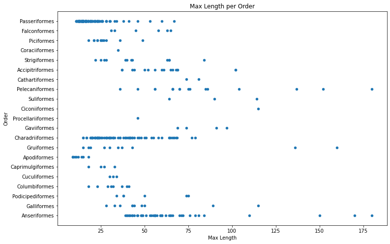

<!-- This gives an overview of the general distribution of body length per bird Order, but it is not the optimal way to display true distributions. That task is usually handled by creating a Histogram. -->
这给出了鸟类各目体长的总体分布概况，但这并不是展示真实分布的最佳方式，直方图更适合完成这项任务。

<!-- ## Working with histograms -->
## 使用直方图

<!-- Matplotlib offers very good ways to visualize data distribution using Histograms. This type of chart is like a bar chart where the distribution can be seen via a rise and fall of the bars. To build a histogram, you need numeric data. To build a Histogram, you can plot a chart defining the kind as 'hist' for Histogram. This chart shows the distribution of MaxBodyMass for the entire dataset's range of numeric data. By dividing the array of data it is given into smaller bins, it can display the distribution of the data's values: -->

Matplotlib 提供了非常好的方法来使用直方图来可视化数据分布。这种类型的图表类似于条形图，可以通过条形的上升和下降来查看分布情况。要构建直方图，可以绘制一个图表，将直方图的类型定义为“hist”。此图表显示了整个数据集的数字数据范围内 MaxBodyMass 的分布。通过将给定的数据数组划分为较小的箱体，它可以显示数据值的分布：

```python
birds['MaxBodyMass'].plot(kind = 'hist', bins = 10, figsize = (12,12))
plt.show()
```
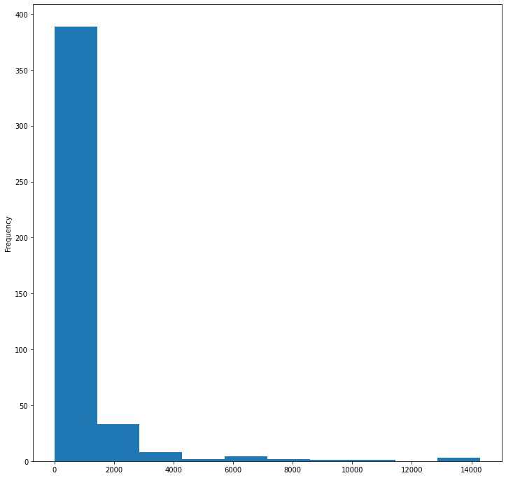

<!-- As you can see, most of the 400+ birds in this dataset fall in the range of under 2000 for their Max Body Mass. Gain more insight into the data by changing  the `bins` parameter to a higher number, something like 30: -->

如图所示，此数据集中的 400 多只鸟中的大多数的最大体重都在 2000 以下。通过将参数更改bins为更高的数字（例如 30），可以更深入地了解数据：

```python
birds['MaxBodyMass'].plot(kind = 'hist', bins = 30, figsize = (12,12))
plt.show()
```
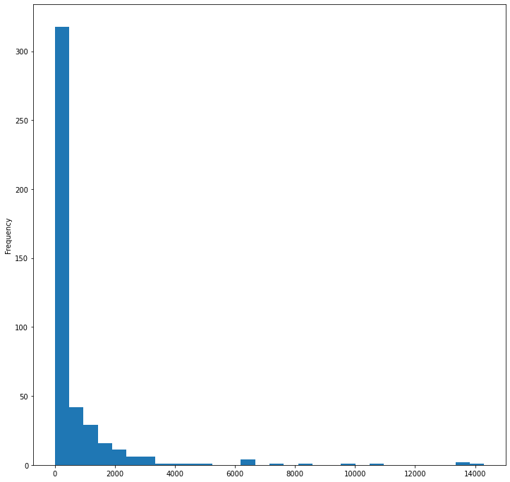

<!-- This chart shows the distribution in a bit more granular fashion. A chart less skewed to the left could be created by ensuring that you only select data within a given range:

Filter your data to get only those birds whose body mass is under 60, and show 40 `bins`: -->

此图表以更精细的方式显示了分布情况。通过确保仅选择给定范围内的数据，可以创建不太向左倾斜的图表：

过滤数据以仅获取体重低于 60 的鸟类，并显示 40 bins：

```python
filteredBirds = birds[(birds['MaxBodyMass'] > 1) & (birds['MaxBodyMass'] < 60)]      
filteredBirds['MaxBodyMass'].plot(kind = 'hist',bins = 40,figsize = (12,12))
plt.show()     
```
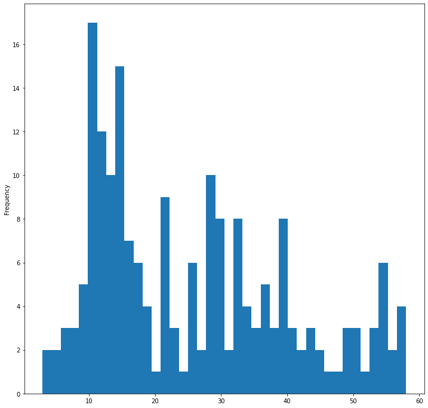

<!-- ✅ Try some other filters and data points. To see the full distribution of the data, remove the `['MaxBodyMass']` filter to show labeled distributions. -->
✅ 尝试一些其他过滤器和数据点。要查看数据的完整分布，请删除['MaxBodyMass']过滤器以显示标记分布。

<!-- The histogram offers some nice color and labeling enhancements to try as well:

Create a 2D histogram to compare the relationship between two distributions. Let's compare `MaxBodyMass` vs. `MaxLength`. Matplotlib offers a built-in way to show convergence using brighter colors: -->

直方图也提供了一些不错的颜色和标签增强功能供您尝试：

创建 2D 直方图来比较两个分布之间的关系。让我们比较MaxBodyMass一下MaxLength。Matplotlib 提供了一种内置方法，使用更亮的颜色来显示收敛：

```python
x = filteredBirds['MaxBodyMass']
y = filteredBirds['MaxLength']

fig, ax = plt.subplots(tight_layout=True)
hist = ax.hist2d(x, y)
```
<!-- There appears to be an expected correlation between these two elements along an expected axis, with one particularly strong point of convergence: -->

这两个元素之间似乎沿着预期的轴存在预期的相关性，并且有一个特别强的汇合点：

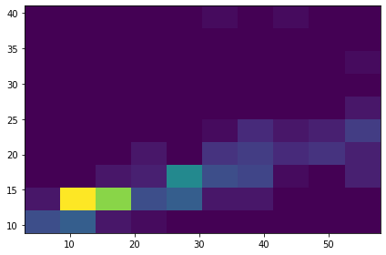

<!-- Histograms work well by default for numeric data. What if you need to see distributions according to text data?  -->
一般情况下，直方图适用于数字数据。如果需要根据文本数据查看分布情况，该怎么办？

<!-- ## Explore the dataset for distributions using text data  -->
## 使用文本数据探索数据集的分布

<!-- This dataset also includes good information about the bird category and its genus, species, and family as well as its conservation status. Let's dig into this conservation information. What is the distribution of the birds according to their conservation status? -->
该数据集还包含有关鸟类类别及其属、种、科以及保护状况的丰富信息。让我们深入研究这些保护信息。根据鸟类的保护状况，它们的分布情况如何？

<!-- > ✅ In the dataset, several acronyms are used to describe conservation status. These acronyms come from the [IUCN Red List Categories](https://www.iucnredlist.org/), an organization that catalogs species' status. -->

> ✅ 在数据集中，使用了几个首字母缩略词来描述保护状况。这些首字母缩略词来自IUCN 红色名录类别，这是一个对物种状况进行分类的组织。

> 
> - CR: Critically Endangered 极度濒危
> - EN: Endangered 濒危
> - EX: Extinct 灭绝
> - LC: Least Concern 不需关注
> - NT: Near Threatened 近危
> - VU: Vulnerable 脆弱

<!-- These are text-based values so you will need to do a transform to create a histogram. Using the filteredBirds dataframe, display its conservation status alongside its Minimum Wingspan. What do you see?  -->
这些是基于文本的值，因此需要进行转换才能创建直方图。使用filteredBirds数据框，显示其保护状态及其最小翼展。你看到了什么？

```python
x1 = filteredBirds.loc[filteredBirds.ConservationStatus=='EX', 'MinWingspan']
x2 = filteredBirds.loc[filteredBirds.ConservationStatus=='CR', 'MinWingspan']
x3 = filteredBirds.loc[filteredBirds.ConservationStatus=='EN', 'MinWingspan']
x4 = filteredBirds.loc[filteredBirds.ConservationStatus=='NT', 'MinWingspan']
x5 = filteredBirds.loc[filteredBirds.ConservationStatus=='VU', 'MinWingspan']
x6 = filteredBirds.loc[filteredBirds.ConservationStatus=='LC', 'MinWingspan']

kwargs = dict(alpha=0.5, bins=20)

plt.hist(x1, **kwargs, color='red', label='Extinct')
plt.hist(x2, **kwargs, color='orange', label='Critically Endangered')
plt.hist(x3, **kwargs, color='yellow', label='Endangered')
plt.hist(x4, **kwargs, color='green', label='Near Threatened')
plt.hist(x5, **kwargs, color='blue', label='Vulnerable')
plt.hist(x6, **kwargs, color='gray', label='Least Concern')

plt.gca().set(title='Conservation Status', ylabel='Min Wingspan')
plt.legend();
```

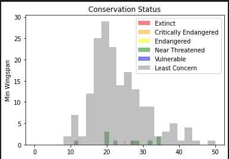

<!-- There doesn't seem to be a good correlation between minimum wingspan and conservation status. Test other elements of the dataset using this method. You can try different filters as well. Do you find any correlation? -->

最小翼展和保护状态之间似乎没有很好的相关性。使用此方法测试数据集的其他元素。也可以尝试不同的过滤器，你能发现其他相关性了吗？

<!-- ## Density plots -->
## 密度图

<!-- You may have noticed that the histograms we have looked at so far are 'stepped' and do not flow smoothly in an arc. To show a smoother density chart, you can try a density plot.

To work with density plots, familiarize yourself with a new plotting library, [Seaborn](https://seaborn.pydata.org/generated/seaborn.kdeplot.html). 

Loading Seaborn, try a basic density plot: -->

到目前为止我们看到的直方图都是“阶梯状”的，并且不是以弧线平滑流动的。要显示更平滑的密度图，您可以尝试密度图。

要使用密度图，请熟悉新的绘图库[Seaborn](https://seaborn.pydata.org/generated/seaborn.kdeplot.html)。

加载 Seaborn，尝试基本密度图：

```python
import seaborn as sns
import matplotlib.pyplot as plt
sns.kdeplot(filteredBirds['MinWingspan'])
plt.show()
```
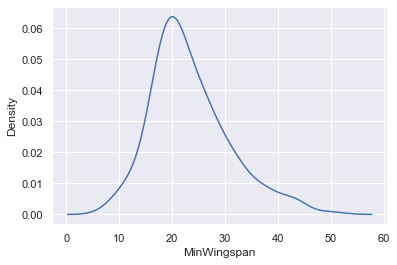

<!-- You can see how the plot echoes the previous one for Minimum Wingspan data; it's just a bit smoother. According to Seaborn's documentation, "Relative to a histogram, KDE can produce a plot that is less cluttered and more interpretable, especially when drawing multiple distributions. But it has the potential to introduce distortions if the underlying distribution is bounded or not smooth. Like a histogram, the quality of the representation also depends on the selection of good smoothing parameters." [source](https://seaborn.pydata.org/generated/seaborn.kdeplot.html) In other words, outliers as always will make your charts behave badly. -->

<!-- If you wanted to revisit that jagged MaxBodyMass line in the second chart you built, you could smooth it out very well by recreating it using this method: -->

可以看到该图与上一个最小翼展数据图相呼应；只是稍微平滑一些。根据 Seaborn 的文档，“相对于直方图，KDE 可以生成更简洁、更易于解释的图，尤其是在绘制多个分布时。但如果底层分布有界或不平滑，则有可能引入扭曲。与直方图一样，表示的质量还取决于良好平滑参数的选择。”来源换句话说，异常值总是会让你的图表表现不佳。

如果想重新查看构建的第二张图表中的锯齿状 MaxBodyMass 线，可以使用此方法重新创建它，使其变得非常平滑：

```python
sns.kdeplot(filteredBirds['MaxBodyMass'])
plt.show()
```
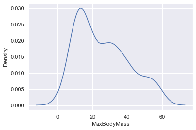

<!-- If you wanted a smooth, but not too smooth line, edit the `bw_adjust` parameter:  -->
如果想要一条平滑但又不太平滑的线条，请编辑bw_adjust参数：

```python
sns.kdeplot(filteredBirds['MaxBodyMass'], bw_adjust=.2)
plt.show()
```
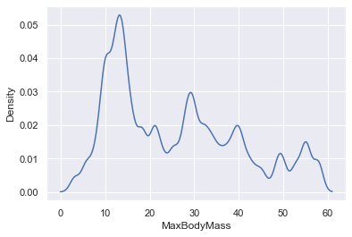

<!-- ✅ Read about the parameters available for this type of plot and experiment! -->
✅ 阅读此类绘图和实验可用的参数！

<!-- This type of chart offers beautifully explanatory visualizations. With a few lines of code, for example, you can show the max body mass density per bird Order: -->
这种图表提供了精美的解释性可视化效果。例如，只需几行代码，就可以显示每只鸟的最大体重密度顺序：

```python
sns.kdeplot(
   data=filteredBirds, x="MaxBodyMass", hue="Order",
   fill=True, common_norm=False, palette="crest",
   alpha=.5, linewidth=0,
)
```

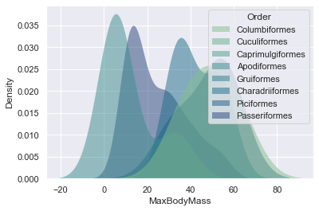

<!-- You can also map the density of several variables in one chart. Text the MaxLength and MinLength of a bird compared to their conservation status: -->

还可以在一个图表中绘制多个变量的密度。将鸟类的最大长度和最小长度与其保护状况进行比较：

```python
sns.kdeplot(data=filteredBirds, x="MinLength", y="MaxLength", hue="ConservationStatus")
```

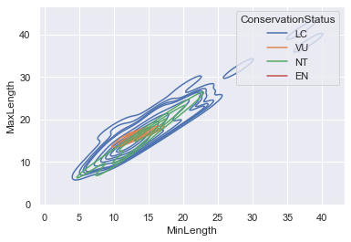

<!-- Perhaps it's worth researching whether the cluster of 'Vulnerable' birds according to their lengths is meaningful or not. -->

也许值得研究根据长度对“脆弱”鸟类进行聚类。

## 🚀 Challenge

<!-- Histograms are a more sophisticated type of chart than basic scatterplots, bar charts, or line charts. Go on a search on the internet to find good examples of the use of histograms. How are they used, what do they demonstrate, and in what fields or areas of inquiry do they tend to be used? -->
直方图是一种比基本散点图、条形图或折线图更复杂的图表类型。在互联网上搜索直方图的使用示例。它们是如何使用的，它们说明了什么，以及它们倾向于在哪些领域或调查领域中使用？

## [Post-lecture quiz](https://purple-hill-04aebfb03.1.azurestaticapps.net/quiz/19)

<!-- ## Review & Self Study -->
## 复习与自学

<!-- In this lesson, you used Matplotlib and started working with Seaborn to show more sophisticated charts. Do some research on `kdeplot` in Seaborn, a "continuous probability density curve in one or more dimensions". Read through [the documentation](https://seaborn.pydata.org/generated/seaborn.kdeplot.html) to understand how it works. -->

在本课中，我们使用了 Matplotlib 并开始使用 Seaborn 来显示更复杂的图表。在 Seaborn 中研究kdeplot“一个或多个维度的连续概率密度曲线”。阅读[文档](https://seaborn.pydata.org/generated/seaborn.kdeplot.html)以了解其工作原理。


## Assignment

[使用你掌握的技能](assignment.md)
