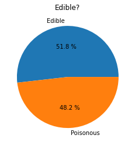
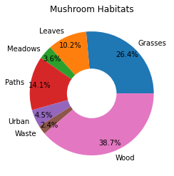
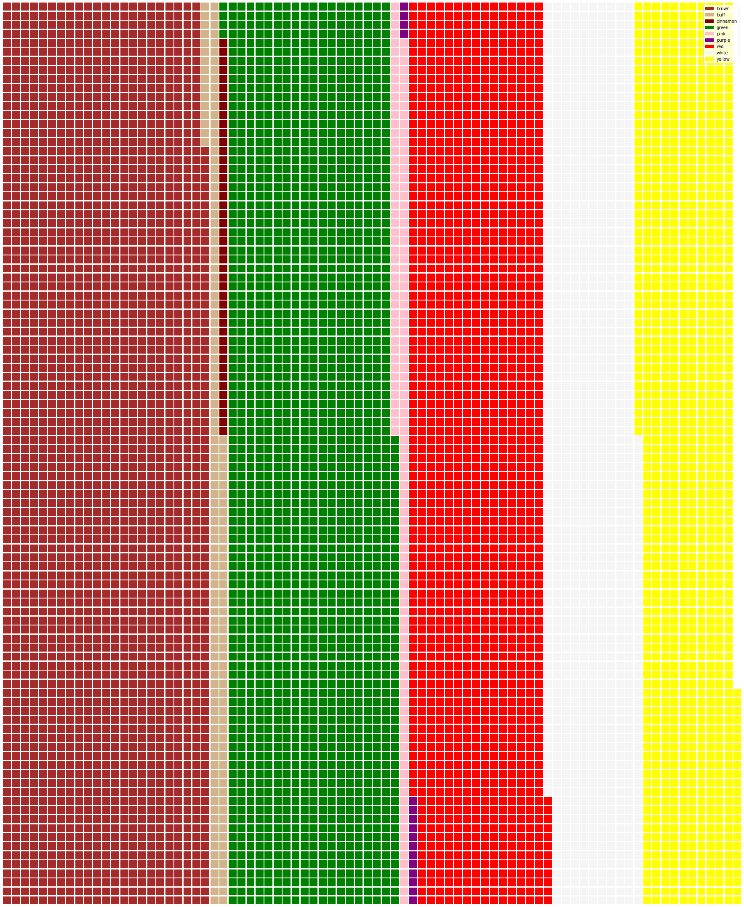

<!-- # Visualizing Proportions -->
# 可视化占比数据

| ](../../sketchnotes/11-Visualizing-Proportions.png)|
|:---:|
|Visualizing Proportions - _Sketchnote by [@nitya](https://twitter.com/nitya)_ |

<!-- In this lesson, you will use a different nature-focused dataset to visualize proportions, such as how many different types of fungi populate a given dataset about mushrooms. Let's explore these fascinating fungi using a dataset sourced from Audubon listing details about 23 species of gilled mushrooms in the Agaricus and Lepiota families. You will experiment with tasty visualizations such as: -->
本节课将使用不同的以自然为中心的数据集来可视化比例，例如有多少种不同类型的真菌填充了给定的蘑菇数据集。让我们使用来自 Audubon 的数据集探索这些迷人的真菌，该数据集列出了有关 Agaricus 和 Lepiota 科中 23 种菌褶蘑菇的详细信息。我们将尝试有趣的可视化，例如：


- Pie charts 🥧 饼图
- Donut charts 🍩 甜甜圈图
- Waffle charts 🧇 华夫饼图

<!-- > 💡 A very interesting project called [Charticulator](https://charticulator.com) by Microsoft Research offers a free drag and drop interface for data visualizations. In one of their tutorials they also use this mushroom dataset! So you can explore the data and learn the library at the same time: [Charticulator tutorial](https://charticulator.com/tutorials/tutorial4.html). -->

## [Pre-lecture quiz](https://purple-hill-04aebfb03.1.azurestaticapps.net/quiz/20)

<!-- ## Get to know your mushrooms 🍄 -->
## 通过数据分析了解蘑菇

<!-- Mushrooms are very interesting. Let's import a dataset to study them: -->
首先，我们导入一个蘑菇相关的数据集进行分析：

```python
import pandas as pd
import matplotlib.pyplot as plt
mushrooms = pd.read_csv('../../data/mushrooms.csv')
mushrooms.head()
```
<!-- A table is printed out with some great data for analysis: -->
打印出的表格包含一些可供分析的重要数据：

| class     | cap-shape | cap-surface | cap-color | bruises | odor    | gill-attachment | gill-spacing | gill-size | gill-color | stalk-shape | stalk-root | stalk-surface-above-ring | stalk-surface-below-ring | stalk-color-above-ring | stalk-color-below-ring | veil-type | veil-color | ring-number | ring-type | spore-print-color | population | habitat |
| --------- | --------- | ----------- | --------- | ------- | ------- | --------------- | ------------ | --------- | ---------- | ----------- | ---------- | ------------------------ | ------------------------ | ---------------------- | ---------------------- | --------- | ---------- | ----------- | --------- | ----------------- | ---------- | ------- |
| Poisonous | Convex    | Smooth      | Brown     | Bruises | Pungent | Free            | Close        | Narrow    | Black      | Enlarging   | Equal      | Smooth                   | Smooth                   | White                  | White                  | Partial   | White      | One         | Pendant   | Black             | Scattered  | Urban   |
| Edible    | Convex    | Smooth      | Yellow    | Bruises | Almond  | Free            | Close        | Broad     | Black      | Enlarging   | Club       | Smooth                   | Smooth                   | White                  | White                  | Partial   | White      | One         | Pendant   | Brown             | Numerous   | Grasses |
| Edible    | Bell      | Smooth      | White     | Bruises | Anise   | Free            | Close        | Broad     | Brown      | Enlarging   | Club       | Smooth                   | Smooth                   | White                  | White                  | Partial   | White      | One         | Pendant   | Brown             | Numerous   | Meadows |
| Poisonous | Convex    | Scaly       | White     | Bruises | Pungent | Free            | Close        | Narrow    | Brown      | Enlarging   | Equal      | Smooth                   | Smooth                   | White                  | White                  | Partial   | White      | One         | Pendant   | Black             | Scattered  | Urban   |

Right away, you notice that all the data is textual. You will have to convert this data to be able to use it in a chart. Most of the data, in fact, is represented as an object:
显而易见，所有数据都是文本，我们必须转换这些数据才能在图表中使用。事实上，大多数数据都表示为对象：

```python
print(mushrooms.select_dtypes(["object"]).columns)
```

The output is:

```output
Index(['class', 'cap-shape', 'cap-surface', 'cap-color', 'bruises', 'odor',
       'gill-attachment', 'gill-spacing', 'gill-size', 'gill-color',
       'stalk-shape', 'stalk-root', 'stalk-surface-above-ring',
       'stalk-surface-below-ring', 'stalk-color-above-ring',
       'stalk-color-below-ring', 'veil-type', 'veil-color', 'ring-number',
       'ring-type', 'spore-print-color', 'population', 'habitat'],
      dtype='object')
```
<!-- Take this data and convert the 'class' column to a category: -->
获取此数据并将“类别”列转换为类别：
```python
cols = mushrooms.select_dtypes(["object"]).columns
mushrooms[cols] = mushrooms[cols].astype('category')
```

```python
edibleclass=mushrooms.groupby(['class']).count()
edibleclass
```

<!-- Now, if you print out the mushrooms data, you can see that it has been grouped into categories according to the poisonous/edible class: -->
如果打印出蘑菇数据，你会看到它已根据有毒/可食用类别分组：

|           | cap-shape | cap-surface | cap-color | bruises | odor | gill-attachment | gill-spacing | gill-size | gill-color | stalk-shape | ... | stalk-surface-below-ring | stalk-color-above-ring | stalk-color-below-ring | veil-type | veil-color | ring-number | ring-type | spore-print-color | population | habitat |
| --------- | --------- | ----------- | --------- | ------- | ---- | --------------- | ------------ | --------- | ---------- | ----------- | --- | ------------------------ | ---------------------- | ---------------------- | --------- | ---------- | ----------- | --------- | ----------------- | ---------- | ------- |
| class     |           |             |           |         |      |                 |              |           |            |             |     |                          |                        |                        |           |            |             |           |                   |            |         |
| Edible    | 4208      | 4208        | 4208      | 4208    | 4208 | 4208            | 4208         | 4208      | 4208       | 4208        | ... | 4208                     | 4208                   | 4208                   | 4208      | 4208       | 4208        | 4208      | 4208              | 4208       | 4208    |
| Poisonous | 3916      | 3916        | 3916      | 3916    | 3916 | 3916            | 3916         | 3916      | 3916       | 3916        | ... | 3916                     | 3916                   | 3916                   | 3916      | 3916       | 3916        | 3916      | 3916              | 3916       | 3916    |

<!-- If you follow the order presented in this table to create your class category labels, you can build a pie chart: -->
如果按照此表中显示的顺序创建类别标签，则可以构建饼图：

<!-- ## Pie! -->
## 饼图

```python
labels=['Edible','Poisonous']
plt.pie(edibleclass['population'],labels=labels,autopct='%.1f %%')
plt.title('Edible?')
plt.show()
```
<!-- Voila, a pie chart showing the proportions of this data according to these two classes of mushrooms. It's quite important to get the order of the labels correct, especially here, so be sure to verify the order with which the label array is built! -->
这张饼图显示了这些数据按照这两种蘑菇类别所占的比例。确保标签的顺序正确非常重要，尤其是在这里，因此一定要验证标签数组的构建顺序！



<!-- ## Donuts! -->
## 甜甜圈图

<!-- A somewhat more visually interesting pie chart is a donut chart, which is a pie chart with a hole in the middle. Let's look at our data using this method.

Take a look at the various habitats where mushrooms grow: -->

圆环图，即中间有一个洞的饼图。让我们用这种方法来查看数据。

看看蘑菇生长的各种栖息地：
```python
habitat=mushrooms.groupby(['habitat']).count()
habitat
```
<!-- Here, you are grouping your data by habitat. There are 7 listed, so use those as labels for your donut chart: -->
在这里，可以按栖息地对数据进行分组。列出的7个栖息地，将它们用作圆环图的标签：

```python
labels=['Grasses','Leaves','Meadows','Paths','Urban','Waste','Wood']

plt.pie(habitat['class'], labels=labels,
        autopct='%1.1f%%', pctdistance=0.85)
  
center_circle = plt.Circle((0, 0), 0.40, fc='white')
fig = plt.gcf()

fig.gca().add_artist(center_circle)
  
plt.title('Mushroom Habitats')
  
plt.show()
```



<!-- This code draws a chart and a center circle, then adds that center circle in the chart. Edit the width of the center circle by changing `0.40` to another value. -->
此代码绘制一个图表和一个中心圆，然后将该中心圆添加到图表中。通过更改0.40为其他值来编辑中心圆的宽度。
<!-- Donut charts can be tweaked in several ways to change the labels. The labels in particular can be highlighted for readability. Learn more in the [docs](https://matplotlib.org/stable/gallery/pie_and_polar_charts/pie_and_donut_labels.html?highlight=donut). -->


可以通过多种方式调整环形图以更改标签。特别是可以突出显示标签以提高可读性。在[文档](https://matplotlib.org/stable/gallery/pie_and_polar_charts/pie_and_donut_labels.html?highlight=donut)中了解更多信息。

现在我们已经知道如何对数据进行分组，然后将其显示为饼图或圆环图，可以探索其他类型的图表。尝试使用华夫饼图，这只是探索数量的另一种方式。

<!-- Now that you know how to group your data and then display it as a pie or donut, you can explore other types of charts. Try a waffle chart, which is just a different way of exploring quantity. -->
<!-- ## Waffles! -->
## 华夫饼图

<!-- A 'waffle' type chart is a different way to visualize quantities as a 2D array of squares. Try visualizing the different quantities of mushroom cap colors in this dataset. To do this, you need to install a helper library called [PyWaffle](https://pypi.org/project/pywaffle/) and use Matplotlib: -->

“华夫饼”类型的图表是将数量可视化为 2D 正方形数组的另一种方式。尝试可视化此数据集中不同数量的蘑菇帽颜色。为此，我们需要安装一个名为[PyWaffle](https://pypi.org/project/pywaffle/)的辅助库并使用 Matplotlib：

```python
pip install pywaffle
```

<!-- Select a segment of your data to group: -->
选择要分组的数据段：

```python
capcolor=mushrooms.groupby(['cap-color']).count()
capcolor
```

<!-- Create a waffle chart by creating labels and then grouping your data: -->
通过创建标签然后对数据进行分组来创建华夫饼图：
```python
import pandas as pd
import matplotlib.pyplot as plt
from pywaffle import Waffle
  
data ={'color': ['brown', 'buff', 'cinnamon', 'green', 'pink', 'purple', 'red', 'white', 'yellow'],
    'amount': capcolor['class']
     }
  
df = pd.DataFrame(data)
  
fig = plt.figure(
    FigureClass = Waffle,
    rows = 100,
    values = df.amount,
    labels = list(df.color),
    figsize = (30,30),
    colors=["brown", "tan", "maroon", "green", "pink", "purple", "red", "whitesmoke", "yellow"],
)
```

<!-- Using a waffle chart, you can plainly see the proportions of cap colors of this mushrooms dataset. Interestingly, there are many green-capped mushrooms! -->
使用华夫饼图，您可以清楚地看到此蘑菇数据集的菌盖颜色比例。有趣的是，有很多绿色菌盖的蘑菇！


<!-- ✅ Pywaffle supports icons within the charts that use any icon available in [Font Awesome](https://fontawesome.com/). Do some experiments to create an even more interesting waffle chart using icons instead of squares. -->
✅ Pywaffle 支持图表中使用[Font Awesome](https://fontawesome.com/)中任何图标。做一些实验，使用图标而不是正方形来创建更有趣的华夫饼图表。

<!-- In this lesson, you learned three ways to visualize proportions. First, you need to group your data into categories and then decide which is the best way to display the data - pie, donut, or waffle. All are delicious and gratify the user with an instant snapshot of a dataset. -->

在本课中，我们学习了三种可视化比例的方法。首先，需要将数据分组，然后确定哪种方式是显示数据的最佳方式 - 饼图、甜甜圈或华夫饼。所有这些都很美味，并且可以通过数据集的即时快照满足用户的需求。

<!-- ## 🚀 Challenge

Try recreating these tasty charts in [Charticulator](https://charticulator.com).
## [Post-lecture quiz](https://purple-hill-04aebfb03.1.azurestaticapps.net/quiz/21) -->

## Review & Self Study

<!-- Sometimes it's not obvious when to use a pie, donut, or waffle chart. Here are some articles to read on this topic: -->
有时，我们并不清楚何时使用饼图、环形图或华夫饼图。以下是一些有关此主题的文章：

https://www.beautiful.ai/blog/battle-of-the-charts-pie-chart-vs-donut-chart

https://medium.com/@hypsypops/pie-chart-vs-donut-chart-showdown-in-the-ring-5d24fd86a9ce

https://www.mit.edu/~mbarker/formula1/f1help/11-ch-c6.htm

https://medium.datadriveninvestor.com/data-visualization-done-the-right-way-with-tableau-waffle-chart-fdf2a19be402

<!-- Do some research to find more information on this sticky decision. -->
## Assignment

[Try it in Excel](assignment.md)
