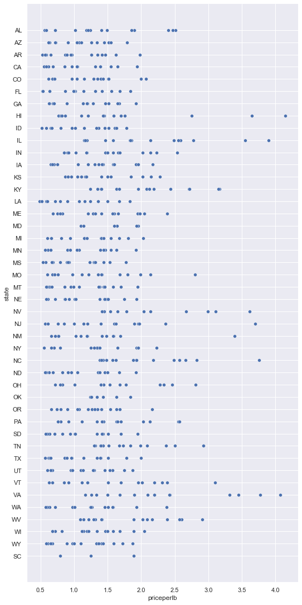
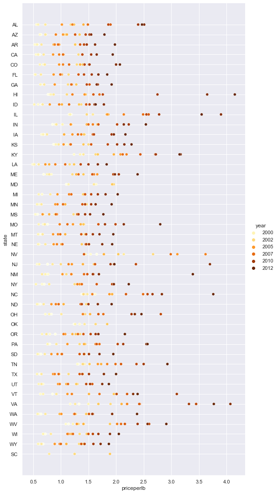
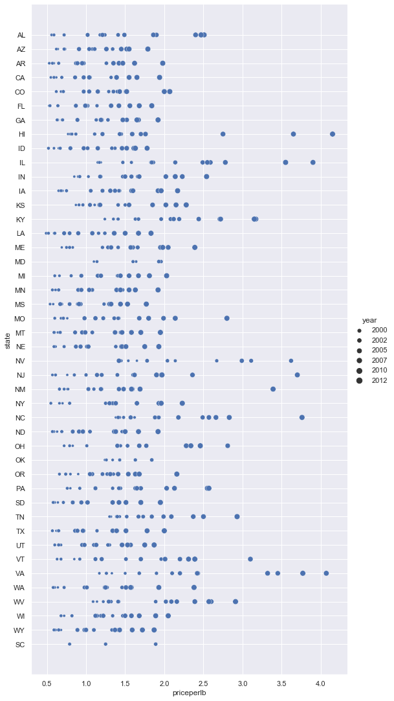
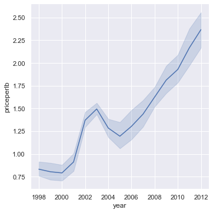
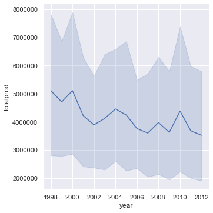
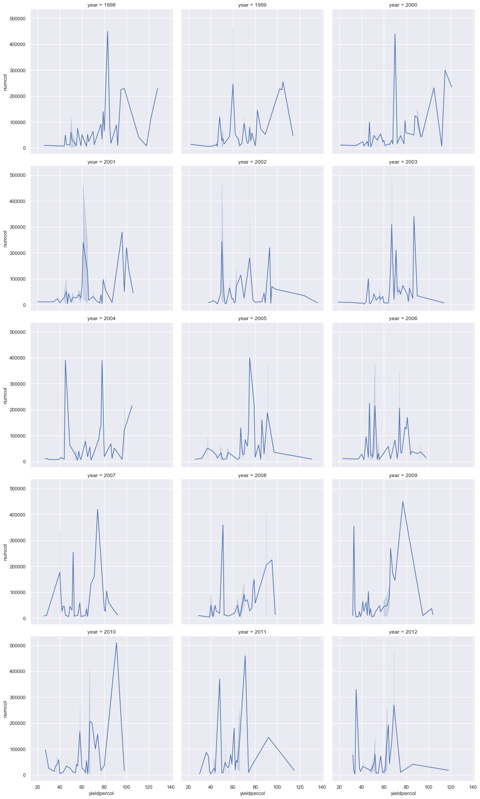
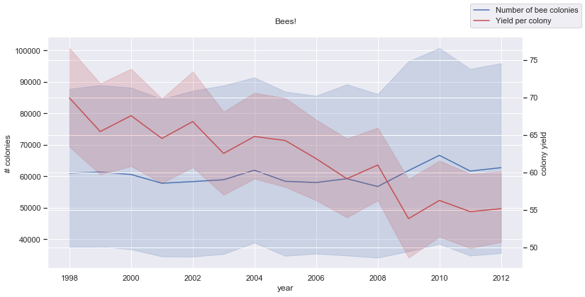

<!-- # Visualizing Relationships: All About Honey 🍯 -->
# 可视化关系：关于蜜蜂

| ](../../sketchnotes/12-Visualizing-Relationships.png)|
|:---:|
|Visualizing Relationships - _Sketchnote by [@nitya](https://twitter.com/nitya)_ |

本节课我们使用有趣的可视化方法来展示不同类型蜂蜜之间的关系。

使用的数据集包含约 600 项内容，展示了美国多个州的蜂蜜产量。例如，您可以查看 1998 年至 2012 年期间某个州的蜂群数量、每个蜂群的产量、总产量、库存、每磅价格和蜂蜜价值，每个州每年一行。

将某个州每年的蜂蜜产量与该州的蜂蜜价格等因素之间的关系可视化会很有趣。或者，你可以将各州每个蜂群的蜂蜜产量之间的关系可视化。
<!-- Continuing with the nature focus of our research, let's discover interesting visualizations to show the relationships between various types of honey, according to a dataset derived from the [United States Department of Agriculture](https://www.nass.usda.gov/About_NASS/index.php).  -->

<!-- This dataset of about 600 items displays honey production in many U.S. states. So, for example, you can look at the number of colonies, yield per colony, total production, stocks, price per pound, and value of the honey produced in a given state from 1998-2012, with one row per year for each state. 

It will be interesting to visualize the relationship between a given state's production per year and, for example, the price of honey in that state. Alternately, you could visualize the relationship between states' honey yield per colony. This year span covers the devastating 'CCD' or 'Colony Collapse Disorder' first seen in 2006 (http://npic.orst.edu/envir/ccd.html), so it is a poignant dataset to study. 🐝 -->

<!-- ## [Pre-lecture quiz](https://purple-hill-04aebfb03.1.azurestaticapps.net/quiz/22)

In this lesson, you can use Seaborn, which you have used before, as a good library to visualize relationships between variables. Particularly interesting is the use of Seaborn's `relplot` function that allows scatter plots and line plots to quickly visualize '[statistical relationships](https://seaborn.pydata.org/tutorial/relational.html?highlight=relationships)', which allow the data scientist to better understand how variables relate to each other. -->

<!-- ## Scatterplots -->
## 散点图

<!-- Use a scatterplot to show how the price of honey has evolved, year over year, per state. Seaborn, using `relplot`, conveniently groups the state data and displays data points for both categorical and numeric data.  -->

<!-- Let's start by importing the data and Seaborn: -->

使用散点图显示各州蜂蜜价格逐年变化情况。Seaborn 使用relplot方便地对州数据进行分组，并显示分类数据和数值数据的数据点。

首先导入数据和 Seaborn：


```python
import pandas as pd
import matplotlib.pyplot as plt
import seaborn as sns
honey = pd.read_csv('../../data/honey.csv')
honey.head()
```
<!-- You notice that the honey data has several interesting columns, including year and price per pound. Let's explore this data, grouped by U.S. state: -->
注意到蜂蜜数据有几个有趣的列，包括年份和每磅价格。让我们探索一下按地区state分组的数据：

| state | numcol | yieldpercol | totalprod | stocks   | priceperlb | prodvalue | year |
| ----- | ------ | ----------- | --------- | -------- | ---------- | --------- | ---- |
| AL    | 16000  | 71          | 1136000   | 159000   | 0.72       | 818000    | 1998 |
| AZ    | 55000  | 60          | 3300000   | 1485000  | 0.64       | 2112000   | 1998 |
| AR    | 53000  | 65          | 3445000   | 1688000  | 0.59       | 2033000   | 1998 |
| CA    | 450000 | 83          | 37350000  | 12326000 | 0.62       | 23157000  | 1998 |
| CO    | 27000  | 72          | 1944000   | 1594000  | 0.7        | 1361000   | 1998 |


<!-- Create a basic scatterplot to show the relationship between the price per pound of honey and its U.S. state of origin. Make the `y` axis tall enough to display all the states: -->
创建一个基本散点图来显示每磅蜂蜜的价格与其产地之间的关系。使轴y足够高以显示所有地区：

```python
sns.relplot(x="priceperlb", y="state", data=honey, height=15, aspect=.5);
```


<!-- Now, show the same data with a honey color scheme to show how the price evolves over the years. You can do this by adding a 'hue' parameter to show the change, year over year: -->
现在，使用蜂蜜配色方案显示相同的数据，以显示价格多年来的变化情况。可以通过添加“色调”参数来显示逐年的变化：

> ✅ Learn more about the [color palettes you can use in Seaborn](https://seaborn.pydata.org/tutorial/color_palettes.html) - try a beautiful rainbow color scheme!
> ✅ 了解更多可以在 [Seaborn] (https://seaborn.pydata.org/tutorial/color_palettes.html)中使用的调色板——尝试美丽的彩虹配色方案！

```python
sns.relplot(x="priceperlb", y="state", hue="year", palette="YlOrBr", data=honey, height=15, aspect=.5);
```


With this color scheme change, you can see that there's obviously a strong progression over the years in terms of honey price per pound. Indeed, if you look at a sample set in the data to verify (pick a given state, Arizona for example) you can see a pattern of price increases year over year, with few exceptions:
通过这种配色方案的变化，我们可以直观的观察到，多年来，每磅蜂蜜的价格显然出现了强劲增长。事实上，如果查看数据中的样本集进行验证（选择一个特定的地区），可以看到价格逐年上涨的模式，只有少数例外：

| state | numcol | yieldpercol | totalprod | stocks  | priceperlb | prodvalue | year |
| ----- | ------ | ----------- | --------- | ------- | ---------- | --------- | ---- |
| AZ    | 55000  | 60          | 3300000   | 1485000 | 0.64       | 2112000   | 1998 |
| AZ    | 52000  | 62          | 3224000   | 1548000 | 0.62       | 1999000   | 1999 |
| AZ    | 40000  | 59          | 2360000   | 1322000 | 0.73       | 1723000   | 2000 |
| AZ    | 43000  | 59          | 2537000   | 1142000 | 0.72       | 1827000   | 2001 |
| AZ    | 38000  | 63          | 2394000   | 1197000 | 1.08       | 2586000   | 2002 |
| AZ    | 35000  | 72          | 2520000   | 983000  | 1.34       | 3377000   | 2003 |
| AZ    | 32000  | 55          | 1760000   | 774000  | 1.11       | 1954000   | 2004 |
| AZ    | 36000  | 50          | 1800000   | 720000  | 1.04       | 1872000   | 2005 |
| AZ    | 30000  | 65          | 1950000   | 839000  | 0.91       | 1775000   | 2006 |
| AZ    | 30000  | 64          | 1920000   | 902000  | 1.26       | 2419000   | 2007 |
| AZ    | 25000  | 64          | 1600000   | 336000  | 1.26       | 2016000   | 2008 |
| AZ    | 20000  | 52          | 1040000   | 562000  | 1.45       | 1508000   | 2009 |
| AZ    | 24000  | 77          | 1848000   | 665000  | 1.52       | 2809000   | 2010 |
| AZ    | 23000  | 53          | 1219000   | 427000  | 1.55       | 1889000   | 2011 |
| AZ    | 22000  | 46          | 1012000   | 253000  | 1.79       | 1811000   | 2012 |


<!-- Another way to visualize this progression is to use size, rather than color. For colorblind users, this might be a better option. Edit your visualization to show an increase of price by an increase in dot circumference: -->

可视化此进展的另一种方法是使用大小，而不是颜色。对于色盲用户，这可能是更好的选择。编辑可视化效果，以显示价格随着点周长的增加而增加：

```python
sns.relplot(x="priceperlb", y="state", size="year", data=honey, height=15, aspect=.5);
```
<!-- You can see the size of the dots gradually increasing. -->
可以看到点的尺寸逐渐增大。



<!-- Is this a simple case of supply and demand? Due to factors such as climate change and colony collapse, is there less honey available for purchase year over year, and thus the price increases? -->

<!-- To discover a correlation between some of the variables in this dataset, let's explore some line charts. -->

这是简单的供需关系吗？由于气候变化和蜂群崩溃等因素，可供购买的蜂蜜是否逐年减少，从而导致价格上涨？

为了发现该数据集中某些变量之间的相关性，让我们探索一些折线图。

<!-- ## Line charts -->
## 折线图

<!-- Question: Is there a clear rise in price of honey per pound year over year? You can most easily discover that by creating a single line chart: -->
问题：蜂蜜每磅的价格是否逐年明显上涨？我们可以通过创建单条折线图轻松发现这一点：
```python
sns.relplot(x="year", y="priceperlb", kind="line", data=honey);
```
<!-- Answer: Yes, with some exceptions around the year 2003: -->
答案：是的，除了 2003 年左右的一些例外：


<!-- ✅ Because Seaborn is aggregating data around one line, it displays "the multiple measurements at each x value by plotting the mean and the 95% confidence interval around the mean". [Source](https://seaborn.pydata.org/tutorial/relational.html). This time-consuming behavior can be disabled by adding `ci=None`. -->
✅ 因为 Seaborn 是围绕一行聚合数据，所以它“通过绘制平均值和平均值周围的 95% 置信区间来显示每个 x 值处的多个测量值”。来源。可以通过添加ci=None来禁用这种耗时的效果。

<!-- Question: Well, in 2003 can we also see a spike in the honey supply? What if you look at total production year over year? -->
问：那么，2003 年蜂蜜供应量是否也会激增？如果逐年查看总产量，结果如何？
```python
sns.relplot(x="year", y="totalprod", kind="line", data=honey);
```



<!-- Answer: Not really. If you look at total production, it actually seems to have increased in that particular year, even though generally speaking the amount of honey being produced is in decline during these years. -->
回答：不是。如果看看总产量，我们会发现那一年的蜂蜜产量实际上似乎有所增加，尽管总体而言这些年蜂蜜产量在下降。
<!-- Question: In that case, what could have caused that spike in the price of honey around 2003?  -->
问：那么，是什么原因导致2003年左右蜂蜜价格飙升呢？

<!-- To discover this, you can explore a facet grid. -->
为了发现这一点，我们需要探索方面网格。
<!-- ## Facet grids -->
## 方面网格

Facet grids take one facet of your dataset (in our case, you can choose 'year' to avoid having too many facets produced). Seaborn can then make a plot for each of those facets of your chosen x and y coordinates for more easy visual comparison. Does 2003 stand out in this type of comparison?

方面网格会取数据集的一个分面（在我们的例子中，可以选择“年份”以避免生成过多的方面）。然后，Seaborn 可以为选择的 x 和 y 坐标的每个分面绘制一个图，以便更轻松地进行视觉比较。在这种比较中，2003 年是否脱颖而出？

<!-- Create a facet grid by continuing to use `relplot` as recommended by [Seaborn's documentation](https://seaborn.pydata.org/generated/seaborn.FacetGrid.html?highlight=facetgrid#seaborn.FacetGrid).  -->

使用 replot 创建方面网格图[Seaborn's documentation](https://seaborn.pydata.org/generated/seaborn.FacetGrid.html?highlight=facetgrid#seaborn.FacetGrid):

```python
sns.relplot(
    data=honey, 
    x="yieldpercol", y="numcol",
    col="year", 
    col_wrap=3,
    kind="line"
```
<!-- In this visualization, you can compare the yield per colony and number of colonies year over year, side by side with a wrap set at 3 for the columns: -->
在此可视化中，您可以并排比较每个菌落的产量和菌落数量，并将列的包装设置为 3：



<!-- For this dataset, nothing particularly stands out with regards to the number of colonies and their yield, year over year and state over state. Is there a different way to look at finding a correlation between these two variables? -->
对于此数据集，就蜂群数量及其产量而言，逐年、逐州而言，没有什么特别突出的。是否有其他方法来寻找这两个变量之间的相关性？

<!-- ## Dual-line Plots -->
## 双线图
<!-- Try a multiline plot by superimposing two lineplots on top of each other, using Seaborn's 'despine' to remove their top and right spines, and using `ax.twinx` [derived from Matplotlib](https://matplotlib.org/stable/api/_as_gen/matplotlib.axes.Axes.twinx.html). Twinx allows a chart to share the x axis and display two y axes. So, display the yield per colony and number of colonies, superimposed: -->
尝试通过将两个线图叠加在一起来绘制多线图，使用 Seaborn 的“despine”删除其顶部和右侧脊线，并使用ax.twinx 从 Matplotlib 派生的。Twinx 允许图表共享 x 轴并显示两个 y 轴。因此，显示每个菌落的产量和菌落数量，叠加：
```python
fig, ax = plt.subplots(figsize=(12,6))
lineplot = sns.lineplot(x=honey['year'], y=honey['numcol'], data=honey, 
                        label = 'Number of bee colonies', legend=False)
sns.despine()
plt.ylabel('# colonies')
plt.title('Honey Production Year over Year');

ax2 = ax.twinx()
lineplot2 = sns.lineplot(x=honey['year'], y=honey['yieldpercol'], ax=ax2, color="r", 
                         label ='Yield per colony', legend=False) 
sns.despine(right=False)
plt.ylabel('colony yield')
ax.figure.legend();
```


<!-- While nothing jumps out to the eye around the year 2003, it does allow us to end this lesson on a little happier note: while there are overall a declining number of colonies, the number of colonies is stabilizing even if their yield per colony is decreasing. -->
尽管 2003 年并没有什么引人注目的事件，但它确实让我们能够以稍微令人高兴的方式结束这堂课：虽然蜂群的数量总体上在减少，但即使每个蜂群的产量在减少，蜂群的数量也趋于稳定。

<!-- Go, bees, go! -->

<!-- 🐝❤️
## 🚀 Challenge

In this lesson, you learned a bit more about other uses of scatterplots and line grids, including facet grids. Challenge yourself to create a facet grid using a different dataset, maybe one you used prior to these lessons. Note how long they take to create and how you need to be careful about how many grids you need to draw using these techniques.
## [Post-lecture quiz](https://purple-hill-04aebfb03.1.azurestaticapps.net/quiz/23) -->

## Review & Self Study

<!-- Line plots can be simple or quite complex. Do a bit of reading in the [Seaborn documentation](https://seaborn.pydata.org/generated/seaborn.lineplot.html) on the various ways you can build them. Try to enhance the line charts you built in this lesson with other methods listed in the docs. -->
线图可以很简单，也可以非常复杂。阅读[Seaborn documentation](https://seaborn.pydata.org/generated/seaborn.lineplot.html)文档，了解构建线图的各种方法。尝试使用文档中列出的其他方法增强您在本课中构建的线图。

## Assignment

[潜入蜂巢](assignment.md)
