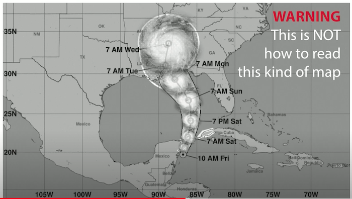
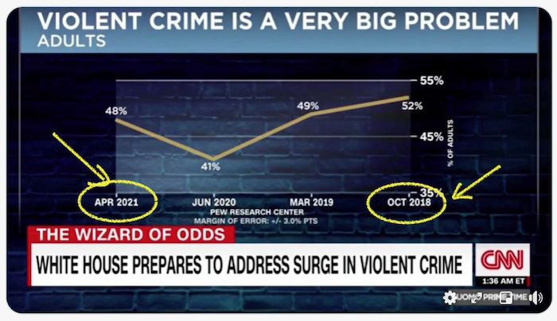
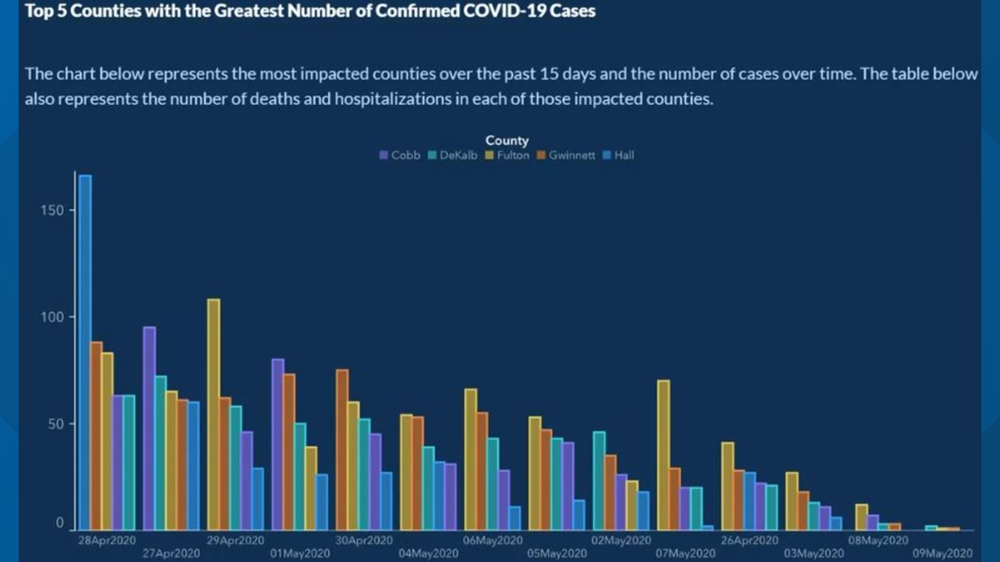
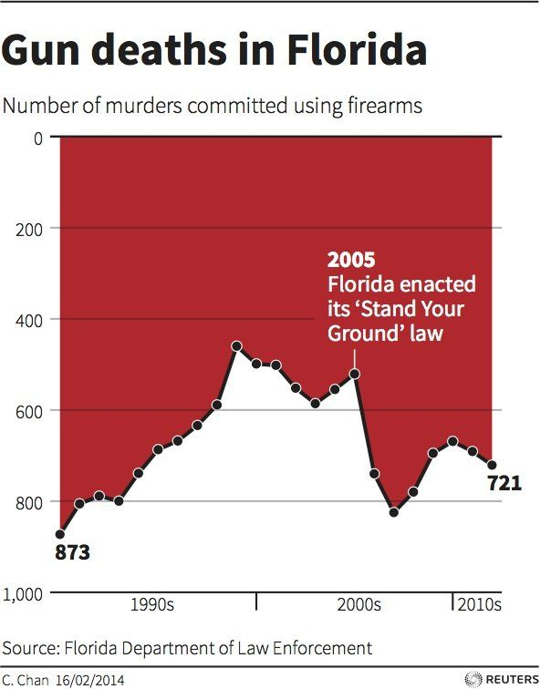
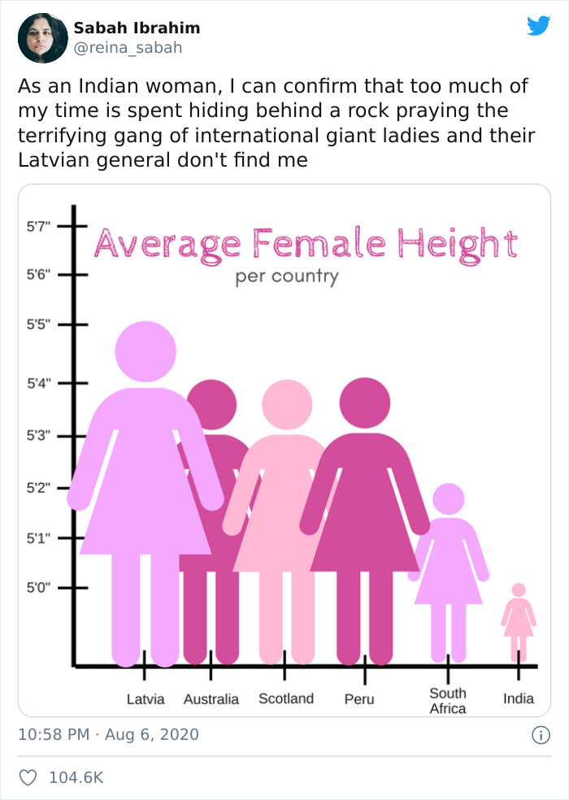
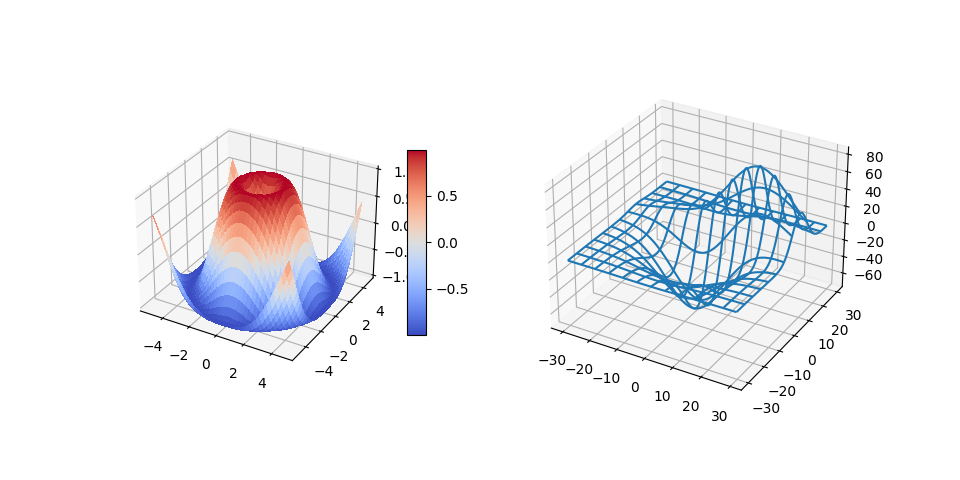
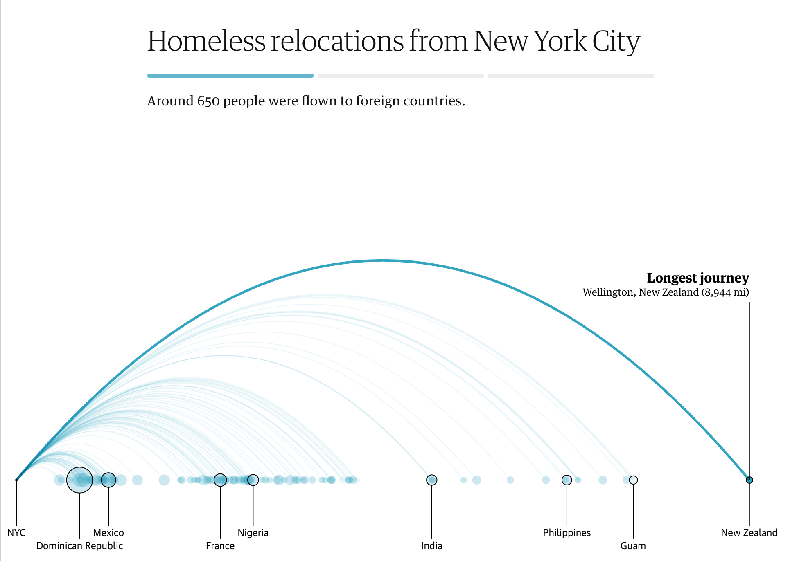
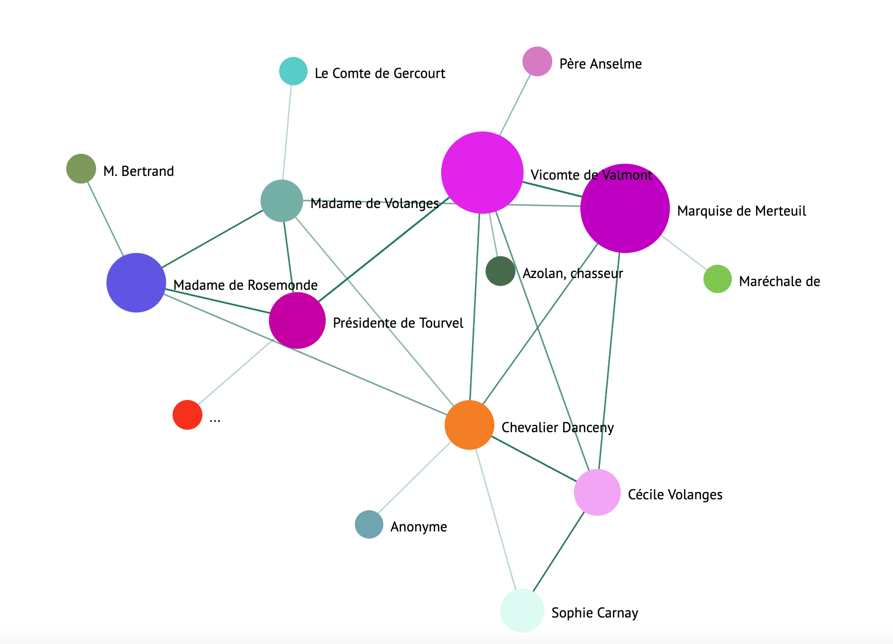

<!-- # Making Meaningful Visualizations -->
# 有意义的可视化
| ](../../sketchnotes/13-MeaningfulViz.png)|
|:---:|
| Meaningful Visualizations - _Sketchnote by [@nitya](https://twitter.com/nitya)_ |

> "If you torture the data long enough, it will confess to anything" -- [Ronald Coase](https://en.wikiquote.org/wiki/Ronald_Coase)

<!-- One of the basic skills of a data scientist is the ability to create a meaningful data visualization that helps answer questions you might have. Prior to visualizing your data, you need to ensure that it has been cleaned and prepared, as you did in prior lessons. After that, you can start deciding how best to present the data. -->
数据科学家的基本技能之一是能够创建有意义的数据可视化，以帮助我们解答可能存在的问题。在可视化数据之前，需要确保数据已经清理和准备好，就像在之前的课程中所做的那样。接下来，我们可以开始决定如何最好地呈现数据。

<!-- In this lesson, you will review:

1. How to choose the right chart type
2. How to avoid deceptive charting
3. How to work with color
4. How to style your charts for readability
5. How to build animated or 3D charting solutions
6. How to build a creative visualization -->

在本课中，我们将回顾：

1. 如何选择正确的图表类型
2. 如何避免欺骗性图表
3. 如何使用颜色
4. 如何设置图表样式以提高可读性
5. 如何构建动画或 3D 图表解决方案
6. 如何构建创意可视化

## [Pre-Lecture Quiz](https://purple-hill-04aebfb03.1.azurestaticapps.net/quiz/24)

<!-- ## Choose the right chart type -->
## 选择正确的图表类型
<!-- In previous lessons, you experimented with building all kinds of interesting data visualizations using Matplotlib and Seaborn for charting. In general, you can select the [right kind of chart](https://chartio.com/learn/charts/how-to-select-a-data-vizualization/) for the question you are asking using this table: -->
在之前的课程中，我们尝试使用 Matplotlib 和 Seaborn 来构建各种有趣的数据可视化图表。通常，您可以使用下表针对您要提出的问题选择正确的图表类型：

| You need to:               | You should use:                 |
| -------------------------- | ------------------------------- |
| Show data trends over time | Line                            |
| Compare categories         | Bar, Pie                        |
| Compare totals             | Pie, Stacked Bar                |
| Show relationships         | Scatter, Line, Facet, Dual Line |
| Show distributions         | Scatter, Histogram, Box         |
| Show proportions           | Pie, Donut, Waffle              |

<!-- > ✅ Depending on the makeup of your data, you might need to convert it from text to numeric to get a given chart to support it. -->
> ✅ 根据数据的构成，您可能需要将其从文本转换为数字以获得给定的图表来支持它。
<!-- ## Avoid deception -->
<!-- ## 避免被误导
<!-- Even if a data scientist is careful to choose the right chart for the right data, there are plenty of ways that data can be displayed in a way to prove a point, often at the cost of undermining the data itself. There are many examples of deceptive charts and infographics! -->
<!-- 即使数据科学家会谨慎地为正确的数据选择正确的图表，但仍有很多方法可以以某种方式显示数据以证明某个观点，而这往往是以破坏数据本身为代价的。有许多欺骗性图表和信息图的例子！

[](https://www.youtube.com/watch?v=oX74Nge8Wkw "How charts lie")

> 🎥 Click the image above for a conference talk about deceptive charts

<!-- This chart reverses the X axis to show the opposite of the truth, based on date: -->
<!-- 此图表根据日期反转 X 轴以显示与事实相反的内容： -->

<!--  -->

<!-- [This chart](https://media.firstcoastnews.com/assets/WTLV/images/170ae16f-4643-438f-b689-50d66ca6a8d8/170ae16f-4643-438f-b689-50d66ca6a8d8_1140x641.jpg) is even more deceptive, as the eye is drawn to the right to conclude that, over time, COVID cases have declined in the various counties. In fact, if you look closely at the dates, you find that they have been rearranged to give that deceptive downward trend. -->

<!--  -->

<!-- This notorious example uses color AND a flipped Y axis to deceive: instead of concluding that gun deaths spiked after the passage of gun-friendly legislation, in fact the eye is fooled to think that the opposite is true: -->

<!--  -->

<!-- This strange chart shows how proportion can be manipulated, to hilarious effect: -->

<!--  -->

<!-- Comparing the incomparable is yet another shady trick. There is a [wonderful web site](https://tylervigen.com/spurious-correlations) all about 'spurious correlations' displaying 'facts' correlating things like the divorce rate in Maine and the consumption of margarine. A Reddit group also collects the [ugly uses](https://www.reddit.com/r/dataisugly/top/?t=all) of data. -->

<!-- It's important to understand how easily the eye can be fooled by deceptive charts. Even if the data scientist's intention is good, the choice of a bad type of chart, such as a pie chart showing too many categories, can be deceptive. --> --> -->

## Color

<!-- You saw in the 'Florida gun violence' chart above how color can provide an additional layer of meaning to charts, especially ones not designed using libraries such as Matplotlib and Seaborn which come with various vetted color libraries and palettes. If you are making a chart by hand, do a little study of [color theory](https://colormatters.com/color-and-design/basic-color-theory) -->
颜色可以为图表提供额外的含义，尤其是那些没有使用 Matplotlib 和 Seaborn 等库设计的图表，这些库带有各种经过审查的颜色库和调色板。如果要手工制作图表，可以稍微研究一下[色彩理论](https://colormatters.com/color-and-design/basic-color-theory)。

<!-- > ✅ Be aware, when designing charts, that accessibility is an important aspect of visualization. Some of your users might be color blind - does your chart display well for users with visual impairments? -->
<!-- > ✅ 在设计图表时，请注意可访问性是可视化的一个重要方面。您的一些用户可能是色盲 - 您的图表是否能很好地显示给有视力障碍的用户？ -->

<!-- Be careful when choosing colors for your chart, as color can convey meaning you might not intend. The 'pink ladies' in the 'height' chart above convey a distinctly 'feminine' ascribed meaning that adds to the bizarreness of the chart itself. -->

<!-- While [color meaning](https://colormatters.com/color-symbolism/the-meanings-of-colors) might be different in different parts of the world, and tend to change in meaning according to their shade. Generally speaking, color meanings include: -->
[颜色的含义](https://colormatters.com/color-symbolism/the-meanings-of-colors)在世界各地可能有所不同，并且往往会根据颜色的深浅而改变。一般来说，颜色的含义包括：

| Color  | Meaning             |
| ------ | ------------------- |
| red    | power               |
| blue   | trust, loyalty      |
| yellow | happiness, caution  |
| green  | ecology, luck, envy |
| purple | happiness           |
| orange | vibrance            |

<!-- If you are tasked with building a chart with custom colors, ensure that your charts are both accessible and the color you choose coincides with the meaning you are trying to convey. -->

<!-- ## Styling your charts for readability -->
## 选择合适的风格提高可读性

<!-- Charts are not meaningful if they are not readable! Take a moment to consider styling the width and height of your chart to scale well with your data. If one variable (such as all 50 states) need to be displayed, show them vertically on the Y axis if possible so as to avoid a horizontally-scrolling chart.

Label your axes, provide a legend if necessary, and offer tooltips for better comprehension of data.

If your data is textual and verbose on the X axis, you can angle the text for better readability. [Matplotlib](https://matplotlib.org/stable/tutorials/toolkits/mplot3d.html) offers 3d plotting, if you data supports it. Sophisticated data visualizations can be produced using `mpl_toolkits.mplot3d`. -->
如果图表不可读，那么它们就毫无意义！花点时间考虑设计图表的宽度和高度，使其与数据很好地匹配。如果需要显示一个变量（例如所有 50 个州），请尽可能在 Y 轴上垂直显示它们，以避免水平滚动图表。

标记坐标轴的含义，如果需要的话提供图例，并提供工具提示以便更好地理解数据。

如果数据是文本形式，且在X轴上显得过于冗长，则可以调整文本的角度以提高可读性。如果数据支持，可提供 3D 绘图。可以使用Matplotlibmpl_toolkits.mplot3d生成复杂的数据可视化。



<!-- ## Animation and 3D chart display -->
## 动画和 3D 图表显示

<!-- Some of the best data visualizations today are animated. Shirley Wu has amazing ones done with D3, such as '[film flowers](http://bl.ocks.org/sxywu/raw/d612c6c653fb8b4d7ff3d422be164a5d/)', where each flower is a visualization of a movie. Another example for the Guardian is 'bussed out', an interactive experience combining visualizations with Greensock and D3 plus a scrollytelling article format to show how NYC handles its homeless problem by bussing people out of the city. -->
当今最好的一些数据可视化作品都是动画。Shirley Wu 使用 D3 制作了一些令人惊叹的作品，例如“电影花”'[film flowers](http://bl.ocks.org/sxywu/raw/d612c6c653fb8b4d7ff3d422be164a5d/)'，其中每朵花都是一部电影的可视化。卫报的另一个例子是“bussed out”，这是一种将可视化与 Greensock 和 D3 相结合的交互式体验，加上滚动文章格式，展示了纽约市如何通过将人们送出城市来解决无家可归者问题。




> "Bussed Out: How America Moves its Homeless" from [the Guardian](https://www.theguardian.com/us-news/ng-interactive/2017/dec/20/bussed-out-america-moves-homeless-people-country-study). Visualizations by Nadieh Bremer & Shirley Wu（《巴士出行：美国如何转移无家可归者》摘自《卫报》。可视化由 Nadieh Bremer 和 Shirley Wu 制作）

<!-- While this lesson is insufficient to go into depth to teach these powerful visualization libraries, try your hand at D3 in a Vue.js app using a library to display a visualization of the book "Dangerous Liaisons" as an animated social network. -->
虽然本课不足以深入讲解这些强大的可视化库，但您可以尝试在 Vue.js 应用程序中使用 D3，使用库将书籍“危险关系”可视化为动画社交网络。

<!-- > "Les Liaisons Dangereuses" is an epistolary novel, or a novel presented as a series of letters. Written in 1782 by Choderlos de Laclos, it tells the story of the vicious, morally-bankrupt social maneuvers of two dueling protagonists of the French aristocracy in the late 18th century, the Vicomte de Valmont and the Marquise de Merteuil. Both meet their demise in the end but not without inflicting a great deal of social damage. The novel unfolds as a series of letters written to various people in their circles, plotting for revenge or simply to make trouble. Create a visualization of these letters to discover the major kingpins of the narrative, visually. -->

>《危险关系》是一部书信体小说，或者说是一部以一系列书信形式呈现的小说。这部小说由 Choderlos de Laclos 于 1782 年创作，讲述了 18 世纪末法国贵族的两个决斗主角——瓦尔蒙子爵和梅尔特伊侯爵夫人——恶毒、道德败坏的社会手段。两人最终都走向灭亡，但同时也造成了巨大的社会伤害。这部小说以一系列写给他们圈子里不同人的信件展开，这些信件的目的是报复或只是为了制造麻烦。创建这些信件的可视化效果，以直观的方式发现叙事的主要人物。

<!-- You will complete a web app that will display an animated view of this social network. It uses a library that was built to create a [visual of a network](https://github.com/emiliorizzo/vue-d3-network) using Vue.js and D3. When the app is running, you can pull the nodes around on the screen to shuffle the data around. -->
我们将完成一个 Web 应用，该应用将显示此社交网络的动画视图[visual of a network](https://github.com/emiliorizzo/vue-d3-network)。它使用一个库，该库是使用 Vue.js 和 D3 构建的，用于创建网络的视觉效果。当应用运行时，可以在屏幕上拖动节点以随机排列数据。


<!-- ## Project: Build a chart to show a network using D3.js -->

## 项目：使用 D3.js 构建图表来显示网络
<!-- > This lesson folder includes a `solution` folder where you can find the completed project, for your reference. -->
> 本课程文件夹包含一个solution文件夹，您可以在其中找到已完成的项目，以供参考。
<!-- 1. Follow the instructions in the README.md file in the starter folder's root. Make sure you have NPM and Node.js running on your machine before installing your project's dependencies.

2. Open the `starter/src` folder. You'll discover an `assets` folder where you can find a .json file with all the letters from the novel, numbered, with a 'to' and 'from' annotation.

3. Complete the code in `components/Nodes.vue` to enable the visualization. Look for the method called `createLinks()` and add the following nested loop. -->

1. 按照启动文件夹根目录中 README.md 文件中的说明进行操作。在安装项目依赖项之前，请确保您的计算机上已运行 NPM 和 Node.js。

2. 打开starter/src文件夹。你会发现一个assets文件夹，里面有一个 .json 文件，里面有小说里的所有信件，都已编号，并带有“收件人”和“发件人”的注释。

3. 完成代码components/Nodes.vue以启用可视化。查找调用的方法createLinks()并添加以下嵌套循环。

<!-- Loop through the .json object to capture the 'to' and 'from' data for the letters and build up the `links` object so that the visualization library can consume it: -->
循环遍历 .json 对象以捕获信件的“收件人”和“发件人”数据并构建对象，links以便可视化库可以使用它：

```javascript
//loop through letters
      let f = 0;
      let t = 0;
      for (var i = 0; i < letters.length; i++) {
          for (var j = 0; j < characters.length; j++) {
              
            if (characters[j] == letters[i].from) {
              f = j;
            }
            if (characters[j] == letters[i].to) {
              t = j;
            }
        }
        this.links.push({ sid: f, tid: t });
      }
  ```

<!-- Run your app from the terminal (npm run serve) and enjoy the visualization! -->
从终端运行您的应用程序（npm run serve）并享受可视化效果！
<!-- ## 🚀 Challenge

Take a tour of the internet to discover deceptive visualizations. How does the author fool the user, and is it intentional? Try correcting the visualizations to show how they should look. -->

<!-- ## [Post-lecture quiz](https://purple-hill-04aebfb03.1.azurestaticapps.net/quiz/25) -->

## Review & Self Study

<!-- Here are some articles to read about deceptive data visualization: -->
以下是一些有关迷惑性数据可视化的文章：
https://gizmodo.com/how-to-lie-with-data-visualization-1563576606

http://ixd.prattsi.org/2017/12/visual-lies-usability-in-deceptive-data-visualizations/

<!-- Take a look at these interest visualizations for historical assets and artifacts: -->
看一下这些对历史资产和文物感兴趣的可视化效果：
https://handbook.pubpub.org/

<!-- Look through this article on how animation can enhance your visualizations: -->
阅读本文，了解动画如何增强你的可视化效果：
https://medium.com/@EvanSinar/use-animation-to-supercharge-data-visualization-cd905a882ad4

## Assignment

[构建自己的可视化](assignment.md)
